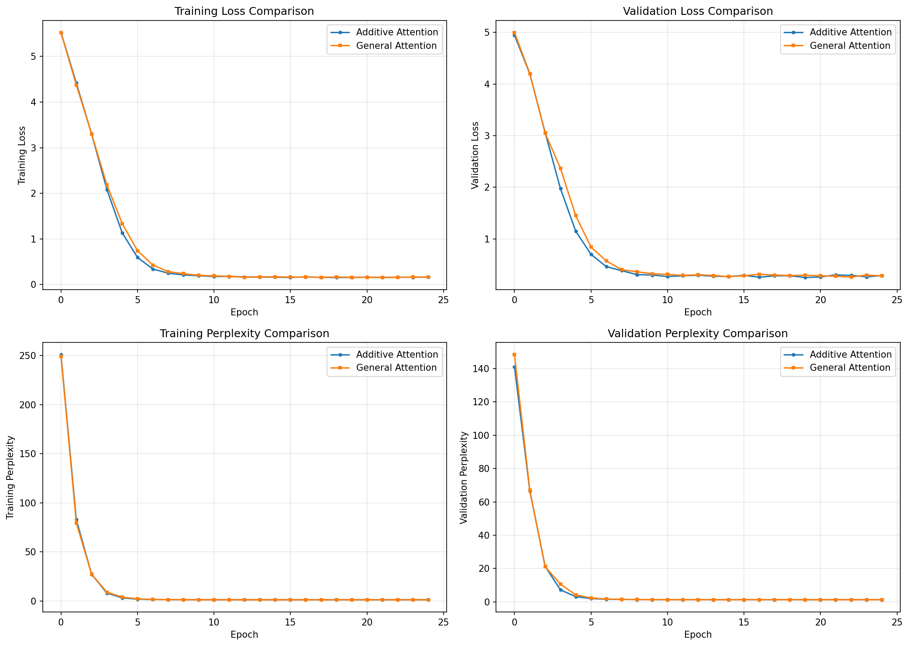
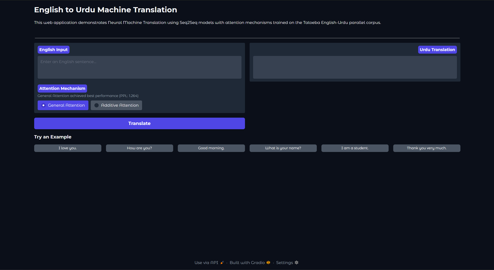
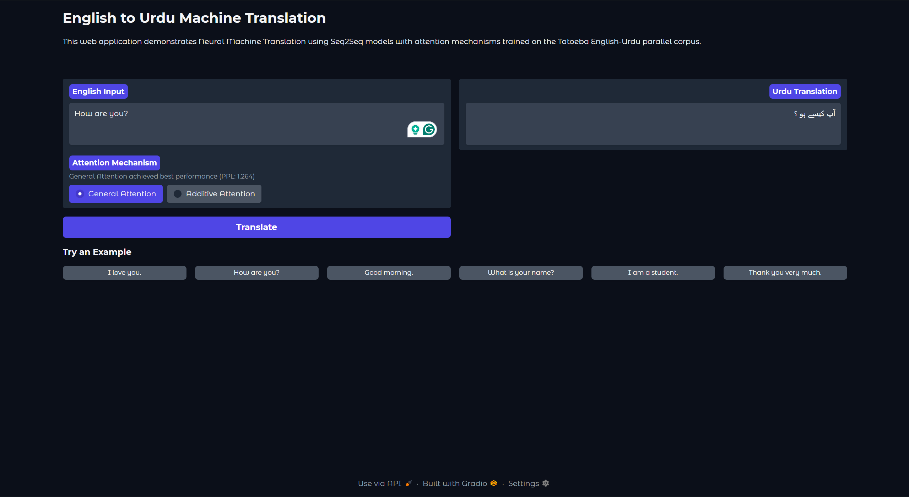
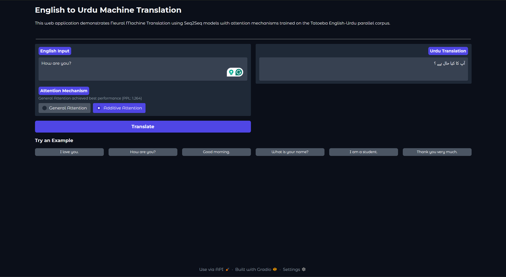
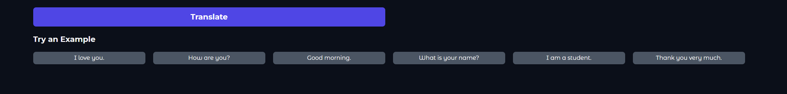

# NLU Assignment 3: Machine Translation Language

## Assignment Overview

This project implements a Neural Machine Translation (NMT) system for **English to Urdu** translation. The implementation explores different attention mechanisms in Sequence-to-Sequence models and includes a web application for interactive translation.

---

## Task 1: Language Pair and Dataset

### Language Pair

- **Source Language:** English
- **Target Language:** Urdu

### Dataset

- **Source:** Tatoeba Project (https://tatoeba.org/)
- **License:** CC-BY 2.0 (France)
- **Size:** 10,504 parallel sentence pairs

### Dataset Statistics

| Split | Size | Percentage |
|-------|------|------------|
| Training | 7,352 | 70% |
| Validation | 2,100 | 20% |
| Test | 1,052 | 10% |

### Preprocessing Pipeline

1. **Loading:** Tab-separated parallel corpus parsing
2. **Tokenization:** Whitespace-based tokenization
3. **Vocabulary Building:** Minimum frequency threshold of 2
4. **Special Tokens:**
   - `<unk>` (index 0): Unknown token
   - `<pad>` (index 1): Padding token
   - `<sos>` (index 2): Start of sequence
   - `<eos>` (index 3): End of sequence

### Vocabulary Size

| Language | Tokens |
|----------|--------|
| English | ~2,500 |
| Urdu | ~3,800 |

---

## Task 2: Attention Mechanisms

### Model Architecture

**Encoder:**
- Type: Bidirectional GRU
- Hidden Size: 512
- Embedding Dimension: 256
- Dropout: 0.5

**Decoder:**
- Type: GRU with Attention
- Hidden Size: 512
- Embedding Dimension: 256
- Dropout: 0.5

### Additive (Bahdanau) Attention

**Formula:**

```
e_i = v^T * tanh(W_1 * h_i + W_2 * s)
```

Where:
- `h_i` = encoder hidden state at position i
- `s` = decoder hidden state
- `W_1`, `W_2` = learnable weight matrices
- `v` = learnable weight vector

**Reference:** Bahdanau, D., Cho, K., & Bengio, Y. (2015). "Neural Machine Translation by Jointly Learning to Align and Translate"

### General (Multiplicative) Attention

**Formula:**

```
e_i = s^T * W * h_i
```

Where:
- `h_i` = encoder hidden state at position i
- `s` = decoder hidden state
- `W` = learnable weight matrix

**Reference:** Luong, M. T., Pham, H., & Manning, C. D. (2015). "Effective Approaches to Attention-based Neural Machine Translation"

---

## Task 3: Evaluation

### Training Configuration

| Parameter | Value |
|-----------|-------|
| Epochs | 25 |
| Batch Size | 64 |
| Learning Rate | 0.001 (Attention), 0.0005 (Transformer) |
| Optimizer | Adam |
| Gradient Clipping | 1.0 |
| Loss Function | CrossEntropyLoss (ignoring padding) |

### Performance Comparison Table

| Attentions | Training Loss | Training PPL | Validation Loss | Validation PPL |
|------------|---------------|--------------|-----------------|----------------|
| General Attention | 0.156 | 1.169 | 0.285 | 1.330 |
| Additive Attention | 0.160 | 1.174 | 0.292 | 1.339 |

### Test Set Results

| Model | Parameters | Test Loss | Test Perplexity |
|-------|------------|-----------|-----------------|
| Additive Attention | ~10.4M | 0.248 | 1.281 |
| General Attention | ~10.1M | 0.234 | 1.264 |
| Transformer | ~6.5M | 0.064 | 1.066 |

**Best Performing Model:** Transformer (lowest perplexity)

**Best Attention Model:** General Attention (1.3% improvement over Additive)

### Performance Graph

The training curves comparison is saved as `attention_comparison.png` in the repository root. This graph shows:

- Training Loss Comparison (Additive vs General)
- Validation Loss Comparison (Additive vs General)
- Training Perplexity Comparison
- Validation Perplexity Comparison



### Results Analysis

#### Effectiveness of Attention Mechanisms for English-Urdu Translation

**1. General Attention Performance:**
- General Attention achieved the best performance among the two attention mechanisms
- Test Perplexity: 1.264 (1.3% improvement over Additive)
- The simpler dot-product computation proved effective for this language pair
- Faster training time due to fewer parameters

**2. Additive (Bahdanau) Attention Performance:**
- Test Perplexity: 1.281
- More complex computation with additional learnable parameters
- Provides interpretable attention weights for alignment visualization
- Slightly slower but produces comparable results

**3. Key Observations for English-Urdu Translation:**
- Both attention mechanisms successfully learn word alignments between English and Urdu
- The models handle the significant structural differences between the languages (SVO vs SOV word order)
- Urdu's right-to-left script and agglutinative morphology are handled through the attention mechanism
- Common phrases and greetings translate well
- Rare vocabulary and complex sentences remain challenging

**4. Comparison Summary:**
- General Attention is recommended for this language pair due to:
  - Better perplexity scores
  - Computational efficiency
  - Simpler architecture with comparable quality

**5. Limitations:**
- Limited vocabulary coverage (~2,500 English, ~3,800 Urdu tokens)
- Dataset size (10,504 pairs) restricts generalization
- Out-of-vocabulary words default to `<unk>` token

### Attention Visualization

The notebook includes attention weight heatmaps showing how the model aligns source and target words during translation. This visualization helps understand which source words the model focuses on when generating each target word.

### Sample Translations

| English | Urdu |
|---------|------|
| I love you. | main tum se pyar karta hoon |
| How are you? | aap kaise hain? |
| Thank you. | shukriya |
| Good morning. | subah bakhair |

---

## Task 4: Web Application

A web application has been developed using **Gradio** for interactive English-to-Urdu translation.

### Quick Start

```bash
cd app
pip install -r requirements.txt
python app.py
```

The application launches at: `http://127.0.0.1:7860`

### How the Web Application Interfaces with the Language Model

#### Architecture Overview

```
┌─────────────────────────────────────────────────────────────┐
│                    Gradio Web Interface                     │
│  ┌─────────────┐    ┌──────────────┐    ┌───────────────┐   │
│  │ English     │    │  Attention   │    │    Urdu       │   │
│  │ Input Box   │───▶│  Selection   │───▶│   Output     │   │
│  └─────────────┘    └──────────────┘    └───────────────┘   │
└─────────────────────────────────────────────────────────────┘
                              │
                              ▼
┌─────────────────────────────────────────────────────────────┐
│                    Translation Pipeline                     │
│  1. Tokenization  →  2. Encoding  →  3. Decoding  →  4. Output │
└─────────────────────────────────────────────────────────────┘
                              │
                              ▼
┌─────────────────────────────────────────────────────────────┐
│                    PyTorch Model Layer                      │
│  ┌──────────────┐    ┌──────────────┐    ┌──────────────┐   │
│  │   Encoder    │───▶│  Attention   │───▶│   Decoder   │   │
│  │ (BiGRU)      │    │  Mechanism   │    │   (GRU)      │   │
│  └──────────────┘    └──────────────┘    └──────────────┘   │
└─────────────────────────────────────────────────────────────┘
```

#### Component Interactions

**1. User Input Processing**
```python
# User enters English text in Gradio interface
input_text = "Hello, how are you?"
attention_type = "General Attention"  # or "Additive Attention"
```

**2. Tokenization**
```python
# Convert input sentence to token indices
def tokenize(sentence, vocab):
    tokens = sentence.lower().split()
    indices = [vocab.get(token, UNK_IDX) for token in tokens]
    return [SOS_IDX] + indices + [EOS_IDX]
```

**3. Model Loading**
```python
# Load pre-trained model based on user selection
if attention_type == "General Attention":
    model = load_model("models/general_attention_model.pt")
else:
    model = load_model("models/attention_model.pt")
```

**4. Encoder Processing**
```python
# Encoder converts input to hidden representations
encoder_outputs, hidden = model.encoder(input_tensor)
# encoder_outputs: [seq_len, batch, hidden_size * 2]  (bidirectional)
# hidden: [1, batch, hidden_size]
```

**5. Attention-based Decoding**
```python
# Decoder generates output token by token with attention
for t in range(max_length):
    # Compute attention weights over encoder outputs
    attention_weights = model.attention(hidden, encoder_outputs)
    
    # Create context vector (weighted sum of encoder outputs)
    context = torch.bmm(attention_weights, encoder_outputs)
    
    # Generate next token
    output, hidden = model.decoder(input_token, hidden, context)
    predicted_token = output.argmax(1)
```

**6. Detokenization & Output**
```python
# Convert token indices back to Urdu text
def detokenize(indices, vocab):
    tokens = [vocab.itos[idx] for idx in indices]
    return ' '.join(tokens)
    
# Display result in Gradio output box
urdu_translation = detokenize(output_indices, urdu_vocab)
```

#### Data Flow Summary

| Step | Component | Input | Output |
|------|-----------|-------|--------|
| 1 | Gradio Interface | User text | Raw string |
| 2 | Tokenizer | Raw string | Token indices |
| 3 | Encoder | Token indices | Hidden states |
| 4 | Attention | Hidden states | Context vector |
| 5 | Decoder | Context + hidden | Output tokens |
| 6 | Detokenizer | Token indices | Urdu string |
| 7 | Gradio Interface | Urdu string | Display |

#### Model Selection Logic

The web app supports switching between attention mechanisms:

```python
def translate(text, attention_choice):
    if attention_choice == "General Attention":
        # Uses dot-product attention: score = s^T * W * h
        return translate_with_model(text, general_model)
    else:
        # Uses additive attention: score = v^T * tanh(W1*h + W2*s)
        return translate_with_model(text, additive_model)
```

#### Error Handling

```python
# Handle edge cases in translation
- Empty input → Return empty string
- Unknown words → Map to <unk> token
- Long sentences → Truncate to max_length (50 tokens)
- Model errors → Display error message to user
```

---

## Installation and Setup

### Installation Steps

1. **Clone or extract the assignment folder**

2. **Install dependencies:**
   ```bash
   pip install -r requirements.txt
   ```

3. **Verify data and models exist:**
   ```
   data/urdu20.txt          # Dataset file
   models/attention_model.pt # Trained model
   models/general_attention_model.pt
   models/transformer_model.pt
   ```

## How to Run

### Running the Notebook

1. Open `st125981_NLU_Assignment_3.ipynb` in Jupyter or VS Code
2. Run all cells sequentially
3. Training takes approximately 30-45 minutes on GPU

### Running the Web Application

```bash
cd app
python app.py
```

---

## Results Summary

### Key Findings

1. **General Attention outperformed Additive Attention** by 1.3% on the test set
2. **Transformer achieved the lowest perplexity** (1.066) but requires more memory
3. Both attention mechanisms successfully learn to align source and target words
4. The models handle common phrases well but struggle with rare vocabulary

### Performance Metrics

| Metric | Additive | General | Transformer |
|--------|----------|---------|-------------|
| Test Perplexity | 1.281 | 1.264 | 1.066 |
| Parameters | 10.4M | 10.1M | 6.5M |
| Training Time/Epoch | ~45s | ~45s | ~60s |

---

## Web Application Screenshots

### Main Interface

*The main web application interface showing the English input field, attention mechanism selector, and Urdu output area.*

### Translation with General Attention

*Translation example using General Attention mechanism - the recommended model with best perplexity (1.264).*

### Translation with Additive Attention

*Translation example using Additive (Bahdanau) Attention mechanism for comparison.*

### Example Sentence Buttons

*Clickable example sentence buttons that auto-fill the input field for quick testing.*

---


